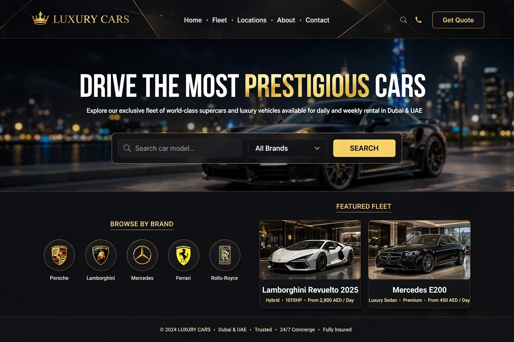
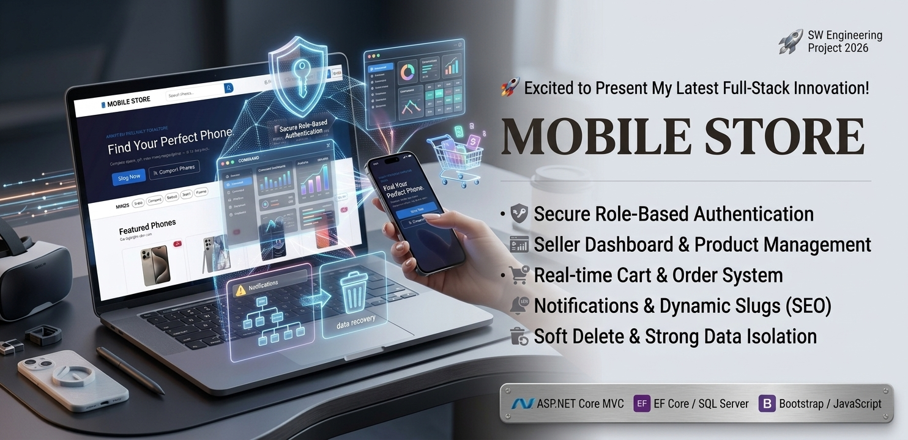
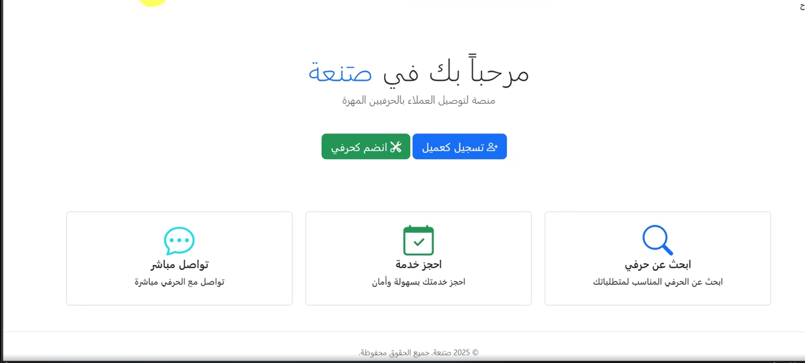
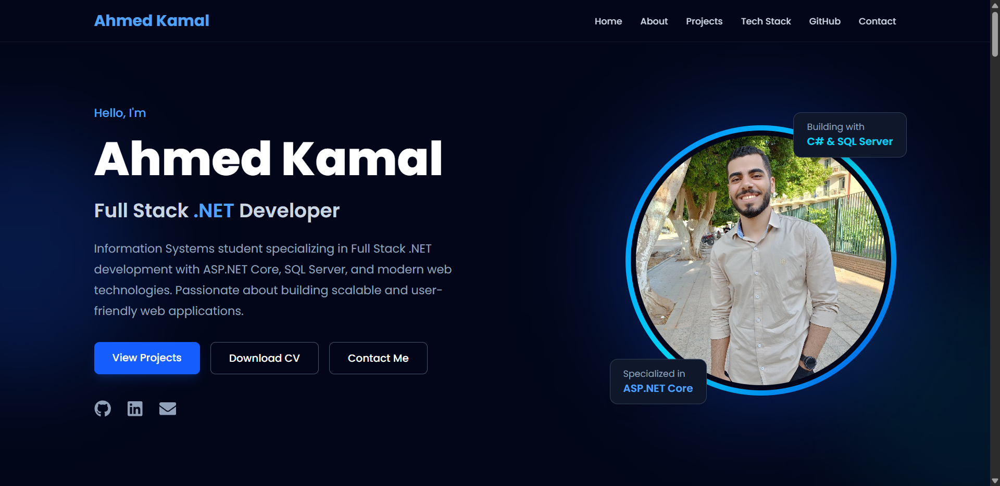

 

  

---

## 👨‍💻 About Me

I'm a **Computer Science student at Assiut University** and a Junior .NET Developer focused on building practical, maintainable web applications.

My main focus is backend and full-stack development with **C#, ASP.NET Core, Entity Framework Core, SQL Server, and REST APIs**, along with modern frontend interfaces built with **React and TypeScript**.

| | |
| :--- | :--- |
| 🎯 **Role** | Junior .NET Developer |
| 🎓 **Education** | Computer Science, Assiut University |
| 🧠 **Focus** | ASP.NET Core · EF Core · SQL Server · REST APIs · React |
| 📚 **Learning** | Advanced ASP.NET Core · Software Architecture · RAG Applications |
| 💼 **Status** | ✅ Open to work |

**What I enjoy working on**

* 🔐 Authentication & Authorization
* 🗄️ Database Design & Management
* 🔌 RESTful APIs & CRUD Operations
* 🏗️ Backend Architecture
* 🎨 Responsive Web Interfaces

---

## 🛠️ Tech Stack

<table>
<tr>
<td align="center"><b>💻 Languages</b></td>
<td>

</td>
</tr>
<tr>
<td align="center"><b>⚙️ Backend</b></td>
<td>
 
ASP.NET Core · MVC · Web API · Entity Framework Core · ASP.NET Identity · LINQ · SignalR
</td>
</tr>
<tr>
<td align="center"><b>🎨 Frontend</b></td>
<td>
 
React · TypeScript · Tailwind CSS · Bootstrap · Framer Motion
</td>
</tr>
<tr>
<td align="center"><b>🗄️ Database</b></td>
<td>

</td>
</tr>
<tr>
<td align="center"><b>🧰 Tools</b></td>
<td>

</td>
</tr>
</table>

---

## 🚀 Featured Projects

<table>
<tr>

<td width="50%" valign="top">

<h3>🚗 Luxury Car Rental</h3>

A full-stack luxury car rental platform where customers browse premium vehicles and submit bookings, and admins manage everything from a dedicated admin area.

<ul>
<li>🚘 Car catalog with detailed specs (price, engine, seats, transmission)</li>
<li>📅 Rental booking requests</li>
<li>🛠️ Admin area: manage cars, images, and bookings</li>
<li>🔐 ASP.NET Identity with role-based authorization</li>
</ul>

<b>Tech:</b> C# · ASP.NET Core MVC · EF Core · SQL Server · Identity

</td>

<td width="50%" valign="top">

<h3>📱 Mobile Store</h3>

An e-commerce platform for selling mobile phones, with a dedicated seller portal and strict seller-level data isolation.

<ul>
<li>🔎 Product browsing, search, and details</li>
<li>👨‍💼 Seller dashboard: add, edit, delete products and images</li>
<li>🔐 Identity, roles, and protected seller pages</li>
<li>🔔 Notifications and user-friendly feedback messages</li>
</ul>

<b>Tech:</b> C# · ASP.NET Core MVC · EF Core · SQL Server · Identity

</td>

</tr>

<tr>

<td width="50%" valign="top">

<h3>🪑 FurniCraft</h3>

A furniture e-commerce web application with an Arabic (RTL) interface, built with ASP.NET Core MVC.

<ul>
<li>🛋️ Product catalog organized by categories</li>
<li>🔎 Product details pages</li>
<li>🛒 Shopping cart</li>
<li>🔐 User registration & login</li>
<li>💵 Cash on delivery checkout</li>
</ul>

<b>Tech:</b> C# · ASP.NET Core MVC · EF Core · Razor Views

</td>

<td width="50%" valign="top">

<h3>🔧 Sanaa</h3>

A platform connecting customers with service providers, built with a structured MVC architecture and real-time communication.

<ul>
<li>📡 Real-time communication with SignalR hubs</li>
<li>🧩 Custom middleware for request processing</li>
<li>🗄️ EF Core Code First with SQL Server</li>
<li>🚀 Deployed on Railway</li>
</ul>

<b>Tech:</b> C# · ASP.NET Core MVC · EF Core · SQL Server · SignalR · Bootstrap

</td>

</tr>

<tr>

<td width="50%" valign="top">

<h3>🌐 Personal Portfolio</h3>

A modern, responsive portfolio showcasing my projects, skills, and development journey.

<b>Built with:</b> ⚛️ React · 📘 TypeScript · ⚡ Vite · 🎨 Tailwind CSS · ✨ Framer Motion

</td>

<td width="50%" valign="top">

<h3>📂 More Projects</h3>

<ul>
<li>📊 <a href="https://github.com/ahmedkamal-31/Customer-Analytics-Dashboard">Customer Analytics Dashboard</a> (Python)</li>
<li>🎮 <a href="https://github.com/ahmedkamal-31/LUGX-Games">LUGX Games</a>, a gaming site front end (HTML/CSS)</li>
</ul>

</td>

</tr>
</table>

---

## 📚 Currently Learning

---

## 📊 GitHub Stats

 

  

<picture>
  <source media="(prefers-color-scheme: dark)" srcset="https://raw.githubusercontent.com/ahmedkamal-31/ahmedkamal-31/output/github-contribution-grid-snake-dark.svg" />
  
</picture>

---

## 🎯 Career Goal

I'm looking for a **Junior .NET Developer** role where I can contribute to real-world projects, strengthen my backend skills, and keep growing as a professional software developer.

---

## 📫 Let's Connect

  

